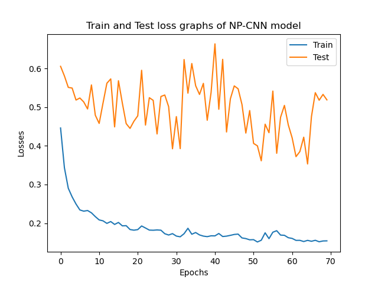
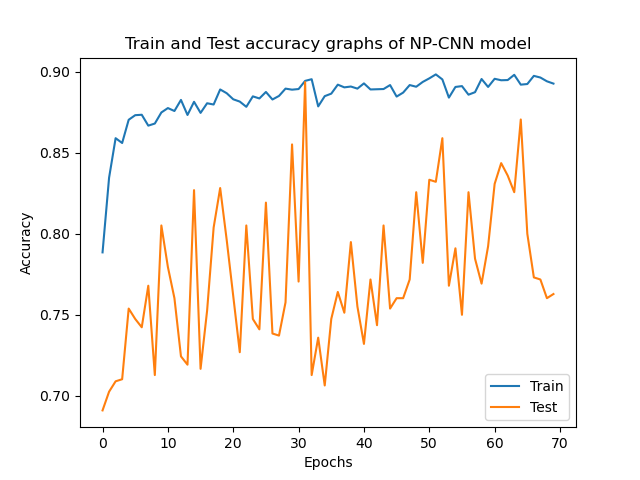
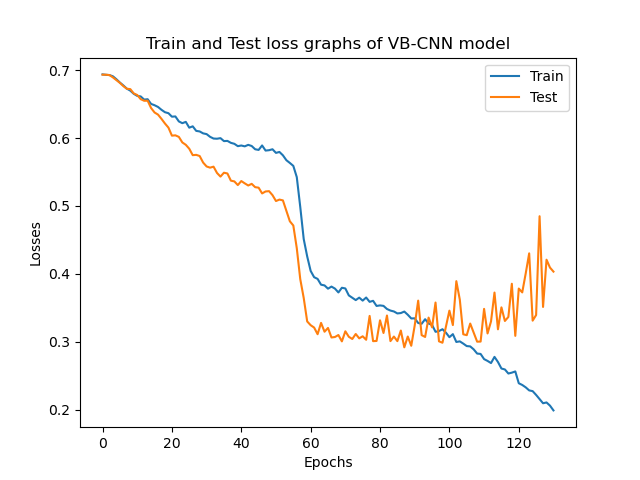
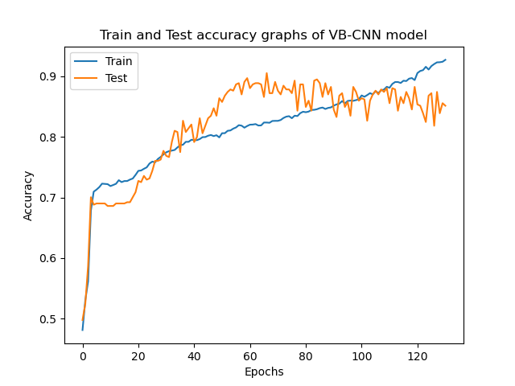
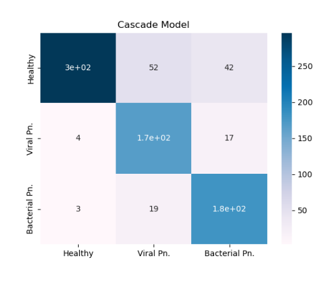
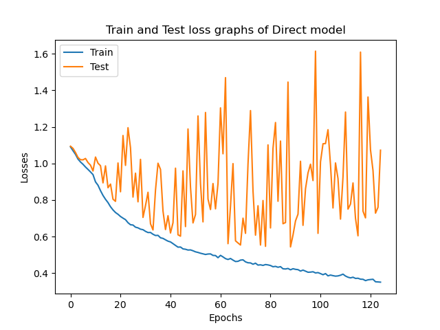
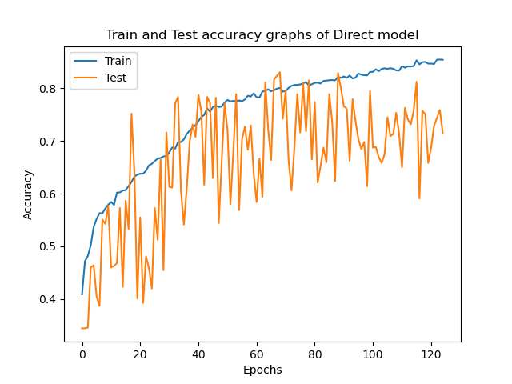
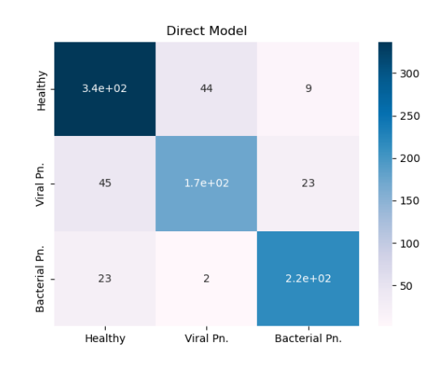
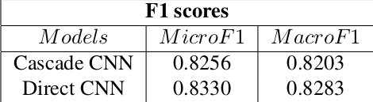

# Pneumonia-Detection-by-CXR-Classification
Main objective of the project is to detect Pneumonia disease by Chest XRay (CXR) image classification. Two different Convolutional Neural Networks were developed in cascade fashion to classify images into Healthy and Pneumonia and Bacterial or Viral Pneumonia. More details can be found in project report.

## Table of Contents
* Brief Information about Project
* Applicational idea

* Evaluation and Results

## Brief Information about Project
In this project two different approaches were applied in order to detect Pneumonia disease by training on datasets of Chest X-Ray images. While the first model is used to detect the pneumonia disease,
the latter is used to detect the kind of it. Thus, we can call our model as Cascade CNN model for CXR classification.

## Applicational Idea
### First Approach
Main approach is to build two different Convolutional Neural Network with diverse but related tasks. The first CNN model is used to detect pneumonia disease through Chest X-Ray (CXR) images dataset. On the other hand,
the second CNN model is used to define whether pneumonia is bacterial or viral. The latter model was trained on the pneumonia labelled dataset of the same dataset. Thus we can see the first model could see more data than the second one.

### Second Approach
I handled the project in 3 class classification fashion where labels were healthy, bacterial-pneumonia and viral-pneumonia, in the second approach. This model is simpler than the first one, since I developed only one model and
evaluated whole data based on its parameters

## Evaluation and Results
### First Approach
At the end, after collecting satisfactory training results, I evaluated data in following steps:
 * First of all I evaluated all dataset in order to see classification predictions on the first task (Pneumonia Detection)
 * After that, I collected data were predicted as Pneumonia and sent them to prediction phase of  the second model (Pneumonia Kind Detection)
 * As a result, collecting data were used to compute confusion matrix and F1 score.
 In the following images you can see Accuracy and Loss results of Pneumonia Detection (NP-CNN) model:
 
 

   
 

On the other hand you can see performance results of the second model of cascade system for 'Viral-Bacterial classification' task (VB-CNN) from the following images:

   
 

 

The following image expresses the Confusion Matrix of Cascade Model through 3 classes:

 

 
 
 
 ### Second Approach
 In the second approach, I directly collected results and evaluated results according to F1-score metrics. Following images express the train and test loss and accuracy results.
 
 The following images express loss and accuracy performance of the direct model, in which image classification is done for 3 classes:
 

   
 

 

Additionally, confusion matrix is represented by the following image:

### Comparison
As a result, it is easy to see that both models performed very similarly that F1 scores are very close to each other. The following table expresses Micro and Macro averaged F1-scores of bot models' results.

