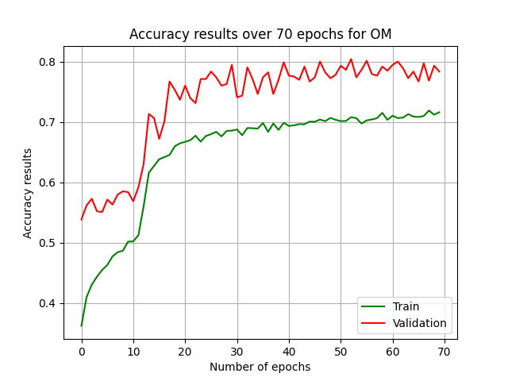

# Pneumonia-Detection-by-CXR-Classification
Main objective of the project is to detect Pneumonia disease by Chest XRay (CXR) image classification. Two different Convolutional Neural Networks were developed in cascade fashion to classify images into Healthy and Pneumonia and Bacterial or Viral Pneumonia. More details can be found in project report.

## Table of Contents
* Brief Information about Project
* Applicational idea

* Evaluation and Results

## Brief Information about Project
In this project two different approaches were applied in order to detect Pneumonia disease by training on datasets of Chest X-Ray images. While the first model is used to detect the pneumonia disease,
the latter is used to detect the kind of it. Thus, we can call our model as Cascade CNN model for CXR classification.

## Idea
### First Approach
For the first approach, one Convolutional Neural Network was developed to classify CXR images into Viral-, Bacterial-Pneumonia and Healthy classes. Thus, it is called one model since, all classification is done explicitly. In other words, model handles classification task with images of 3 classes.
### Second Approach
The second approach works as 'divide and conquer' idea. It includes two CNN models. While the first one is used to classify CXR images into Pneumonia and Healthy classes (PH model), the latter is used for classifying pneumonia labelled images into Viral- and Bacterial-Pneumonia classes (VB model). Thus, we call the second approach as Cascade Model.
## Evaluation and Results
### First Approach
The first approach is simple mult-label classification task, so that evaluation is simple as its kinds. During training session we also evaluate the model over development dataset. Additionally, at each epoch F1-score is also computed. After the training, the model parameters with the best F1-score is used for generating the confusion matrix.
Following figures depict loss and accuracy graphs of the approach. Even though result is satisfactory, we will improve the results in future.

   
 

 
Additionally, the following figure depicts confusion matrix, which was generated on uniformly distributed dataset with 3 labels:

### Second Approach
For this model, we use PH model's dataset, in wich number of healthy and Pneumonia (we did not keep pneumonia sorts uniformed here) data are equal. Consufion matrix and F1 score are computed manually, since there is not such third-party function to compute F1 score or to generate confusion matrix for this kind of task. Evaluation is done in the following manner:

 * PH images are inferred by PH model and images are collected according to their actual label and prediction label;
 * Images which were classified as Pneumonia at the first step, are fed into VB model in order to detect the kind of Pneumonia disease. As we did at the first step, prediction results are collected according to their actual and prediction variable.
 * Using this information was collected through 2 steps, we generate confusion matrix and compute F1-score accordingly.
 
Following figures depict loss and accuracy graphs of PH model:
 

  
 

On the other hand you can find performance results of VB model, which are depicted by the following figures:

  
 
 

Following figures depict confusion matricces for PH and VB models, respectively:

  
 
 
 
At the end of evaluation results for the second approach, we provide confusion matrix of cascade model by following figure:

  
 
 

